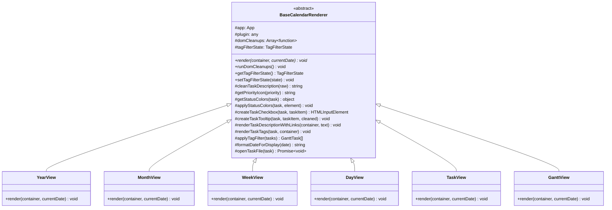
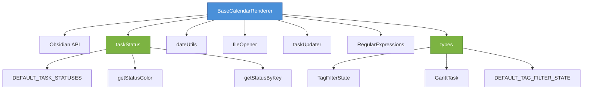
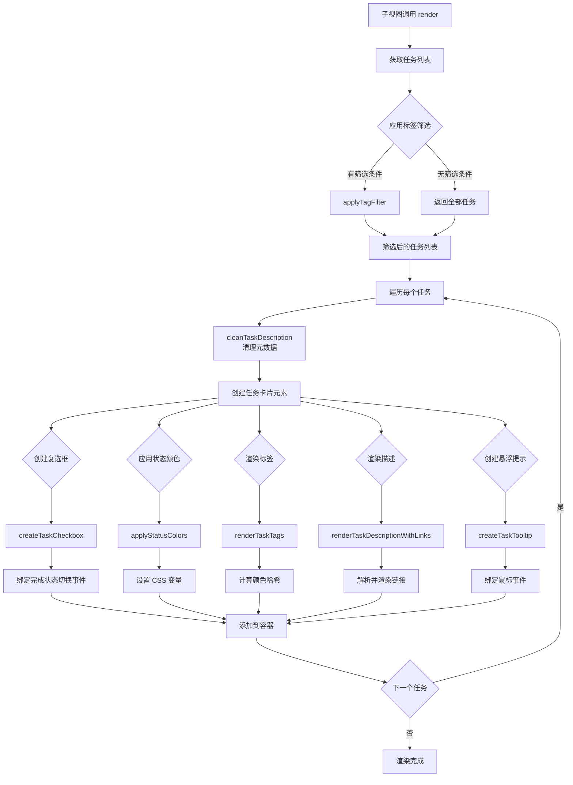
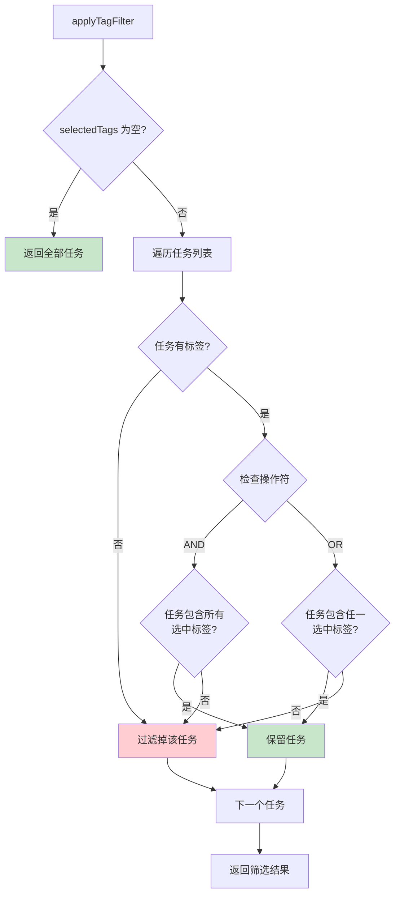
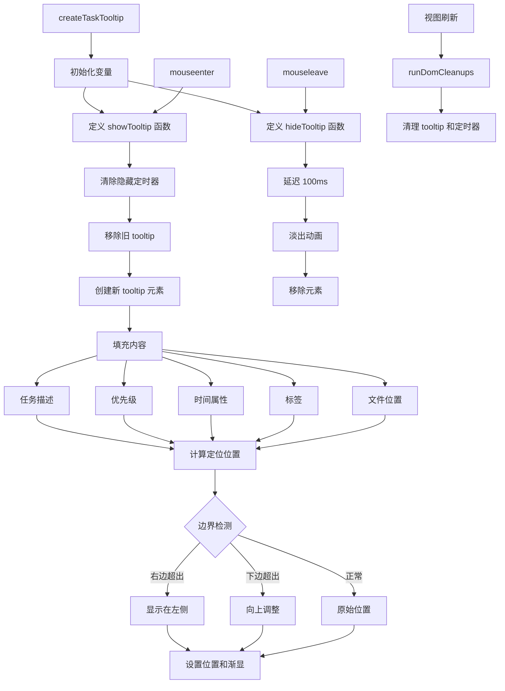
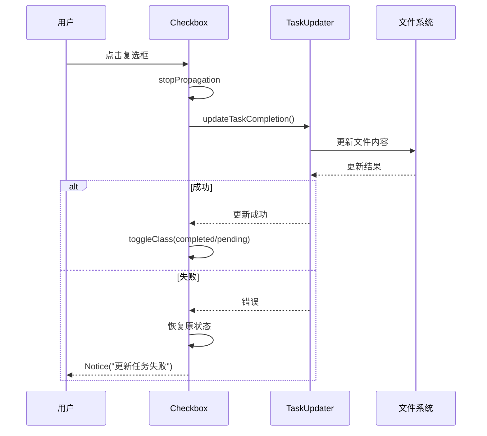
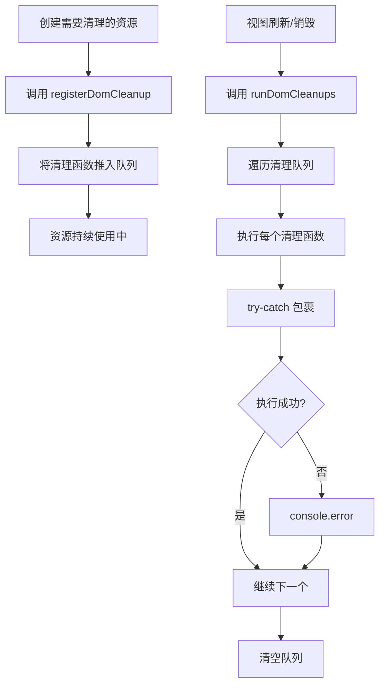
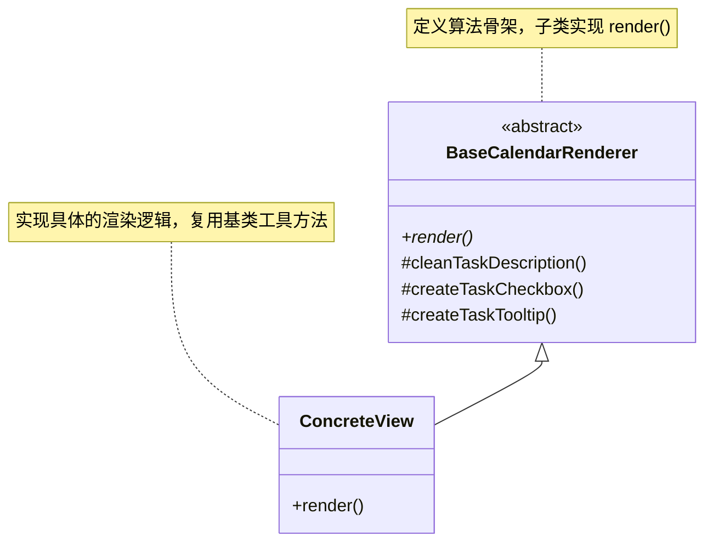
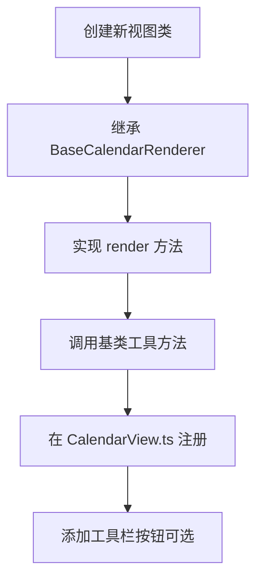

# BaseCalendarRenderer 架构分析报告

## 1. 概述

`BaseCalendarRenderer` 是一个抽象基类，位于 `src/views/BaseCalendarRenderer.ts`，为插件中所有日历子视图提供共享的工具方法和状态管理。它是日历视图系统的核心基础设施。

### 继承关系

```
BaseCalendarRenderer (抽象基类)
├── YearView    (年视图)
├── MonthView   (月视图)
├── WeekView    (周视图)
├── DayView     (日视图)
├── TaskView    (任务视图)
└── GanttView   (甘特图视图)
```

---

## 2. 架构图

### 2.1 类架构图



### 2.2 模块依赖图



---

## 3. 核心功能模块

### 3.1 状态管理

| 属性 | 类型 | 作用 |
|------|------|------|
| `app` | `App` | Obsidian 应用实例 |
| `plugin` | `any` | 插件实例，访问设置和配置 |
| `domCleanups` | `Array<() => void>` | DOM 清理回调队列 |
| `tagFilterState` | `TagFilterState` | 标签筛选状态 |

### 3.2 抽象方法

```typescript
abstract render(container: HTMLElement, currentDate: Date): void;
```
子类必须实现此方法，定义各自的渲染逻辑。

---

## 4. 逻辑链路图

### 4.1 任务渲染流程



### 4.2 标签筛选逻辑



### 4.3 任务描述链接渲染流程

```mermaid
flowchart TD
    A[renderTaskDescriptionWithLinks] --> B[获取正则表达式]
    B --> C[obsidianLinkRegex<br/>[[note]或[note|alias]]]
    B --> D[markdownLinkRegex<br/>[text](url)]
    B --> BFF[urlRegex<br/>http/https链接]

    C --> E[收集所有 Obsidian 链接匹配]
    D --> F[收集所有 Markdown 链接匹配]
    BFF --> G[收集所有 URL 匹配]

    E --> H[按位置排序]
    F --> H
    G --> H

    H --> I[去重重叠匹配]
    I --> J[遍历唯一匹配]

    J --> K{前面有普通文本?}
    K -->|是| L[appendText]
    K -->|否| M{链接类型}

    M -->|obsidian| N[创建双向链接]
    N --> N1[设置点击事件→打开文件]

    M -->|markdown| O[创建 Markdown 链接]
    O --> O1[target=_blank]

    M -->|url| P[创建 URL 链接]
    P --> P1[target=_blank]

    N1 --> Q[下一个匹配]
    O1 --> Q
    P1 --> Q

    Q --> R{还有剩余文本?}
    R -->|是| S[appendText 剩余文本]
    R -->|否| T[完成]

    style N fill:#fff9c4
    style O fill:#e1bee7
    style P fill:#bbdefb
```

### 4.4 任务悬浮提示生命周期



---

## 5. 关键方法详解

### 5.1 cleanTaskDescription - 描述清理

**作用**：移除任务描述中的元数据标记，使显示更清晰。

**处理内容**：
```typescript
// 输入示例
"完成报告 🔺 ⏫ ➕ 2025-01-10 📅 2025-01-15 [priority:: high]"

// 输出示例
"完成报告"
```

**清理规则**：
| 规则 | 正则表达式 | 说明 |
|------|-----------|------|
| 优先级 emoji | `/(🔺\|⏫\|🔼\|🔽\|⏬)/g` | Tasks 插件优先级 |
| 日期属性 | `/(➕\|🛫\|⏳\|📅\|❌\|✅)\s*\d{4}-\d{2}-\d{2}/g` | Tasks 插件日期 |
| Dataview 字段 | `/\[(priority\|created\|start\|scheduled\|due\|cancelled\|completion)::[^\]]+\]/g` | Dataview 字段块 |

### 5.2 createTaskCheckbox - 复选框创建

**功能链路**：


### 5.3 renderTaskTags - 标签渲染

**颜色分配算法**：
```typescript
// 基于字符串哈希的确定性颜色分配
hash = ((hash << 5) - hash) + charCode
colorIndex = abs(hash) % 6  // 0-5 共6种颜色
```

**颜色映射**：
| Index | CSS 类 | 颜色主题 |
|-------|--------|---------|
| 0 | `gc-tag--color-0` | 红色系 |
| 1 | `gc-tag--color-1` | 蓝色系 |
| 2 | `gc-tag--color-2` | 绿色系 |
| 3 | `gc-tag--color-3` | 黄色系 |
| 4 | `gc-tag--color-4` | 紫色系 |
| 5 | `gc-tag--color-5` | 橙色系 |

### 5.4 getStatusColors - 状态颜色

**数据源优先级**：
```mermaid
flowchart LR
    A[获取状态颜色] --> B{plugin.settings<br/>.taskStatuses?}
    B -->|存在| C[使用自定义配置]
    B -->|不存在| D[使用 DEFAULT_TASK_STATUSES]
    C --> E[getStatusColor]
    D --> E
    E --> F{找到匹配?}
    F -->|是| G[返回 {bg, text}]
    F -->|否| H[返回 null]
```

---

## 6. DOM 清理机制

### 6.1 清理注册流程



### 6.2 资源类型

| 资源类型 | 清理操作 | 使用场景 |
|---------|---------|---------|
| 悬浮提示 | `tooltip.remove()` | 视图刷新时移除残留 tooltip |
| 定时器 | `clearTimeout()` | 清理延迟执行的定时器 |
| 事件监听 | 一般由 GC 自动处理 | 复杂情况需手动解绑 |

---

## 7. 设计模式分析

### 7.1 模板方法模式



**优点**：
- 代码复用：公共逻辑集中在基类
- 扩展性强：新增视图只需实现 `render()`
- 维护性好：修改公共逻辑只需改基类

### 7.2 依赖注入

```typescript
constructor(app: App, plugin: any) {
    this.app = app;      // 注入 Obsidian App
    this.plugin = plugin; // 注入插件实例
}
```

**好处**：
- 便于单元测试（可注入 mock 对象）
- 解耦插件实例和渲染器
- 灵活获取配置和设置

---

## 8. 数据流向图

```mermaid
flowchart LR
    subgraph Input["输入数据"]
        A1[GanttTask[]]
        A2[TagFilterState]
        A3[plugin.settings]
    end

    subgraph Process["BaseCalendarRenderer"]
        B1[applyTagFilter]
        B2[cleanTaskDescription]
        B3[renderTaskTags]
        B4[renderTaskDescriptionWithLinks]
        B5[createTaskCheckbox]
        B6[createTaskTooltip]
    end

    subgraph Output["DOM 输出"]
        C1[任务卡片元素]
        C2[复选框]
        C3[标签列表]
        C4[富文本描述]
        C5[悬浮提示]
    end

    subgraph External["外部服务"]
        D1[App.metadataCache]
        D2[taskUpdater]
        D3[fileOpener]
    end

    A1 --> B1
    A2 --> B1
    A3 --> B4
    A3 --> B6

    B1 --> B2
    B2 --> B3
    B2 --> B4
    B2 --> B5
    B2 --> B6

    B3 --> C3
    B4 --> C4
    B5 --> C2
    B6 --> C5

    B5 --> D2
    B4 --> D1
    B6 --> D3
```

---

## 9. 扩展点

### 9.1 新增视图步骤



### 9.2 可复用的工具方法

| 方法 | 可复用场景 |
|------|-----------|
| `cleanTaskDescription` | 任何需要显示任务描述的地方 |
| `getPriorityIcon` | 优先级可视化 |
| `applyStatusColors` | 状态样式应用 |
| `createTaskCheckbox` | 任务列表复选框 |
| `createTaskTooltip` | 详细信息悬浮显示 |
| `renderTaskTags` | 标签列表渲染 |
| `renderTaskDescriptionWithLinks` | 富文本链接渲染 |
| `applyTagFilter` | 标签筛选逻辑 |

---

## 10. 总结

`BaseCalendarRenderer` 是一个设计良好的抽象基类，体现了以下设计原则：

1. **单一职责**：专注于视图渲染的基础设施
2. **开闭原则**：对扩展开放（新增视图），对修改封闭
3. **里氏替换**：所有子类可替换基类使用
4. **依赖倒置**：依赖抽象（App 接口）而非具体实现

**核心价值**：
- 减少约 60-70% 的重复代码
- 统一任务渲染行为
- 便于功能迭代和维护
- 为新视图提供完整工具集

**代码行数**：约 514 行，包含 8 个主要工具方法和完整的状态管理机制。
